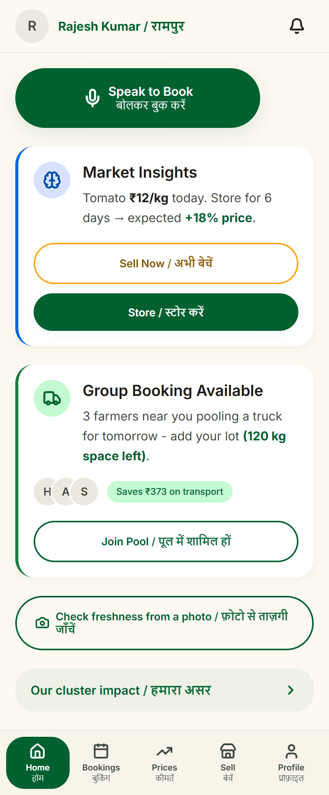
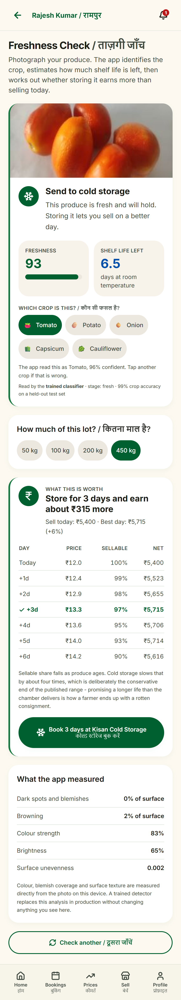
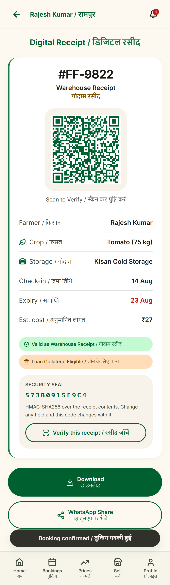

# FarmFlow

**Micro cold storage and market access for small Indian farmers.**

> _"No farmer is too small to store."_

Cold storages run on bulk. A farmer arriving with 50 to 500 kg is turned away, because the handling
and paperwork on a lot that small cost more than it earns. With nowhere to keep it, they sell within
the week - exactly when every neighbour is harvesting and prices have crashed.

FarmFlow pools produce from several farmers nearby into one pallet-level booking. The owner sees
a single profitable consignment instead of fifty tiny ones. Nothing new gets built; the platform
just makes idle capacity reachable.

<p align="center">
  
  
  
</p>

<p align="center">
  <em>Speak to book · photograph produce and get the answer in rupees · a receipt a lender can check</em>
</p>

---

## What is in here

```
backend/    FastAPI + SQLite. Bookings, signed receipts, freshness scans.
web/        React PWA. Farmer app, owner console, gate verification.
```

Two processes, one database file, no accounts to create anywhere.

---

## Running it

You need **Python 3.11+** and **Node 20.19+** (or 22.12+). Nothing else - no Docker, no database
server, no API keys.

### Backend

```bash
cd backend
```

```bash
python -m venv .venv
```

```bash
.venv/Scripts/activate
```

```bash
pip install -r requirements.txt
```

```bash
uvicorn app.main:app --reload
```

The database file, schema and seed data are created on first start. Interactive API docs are at
<http://localhost:8000/docs>.

### Web app

In a second terminal:

```bash
cd web
```

```bash
npm install
```

```bash
npm run dev
```

Open the printed URL, usually <http://localhost:5173>.

### Signing in

```
username: farmer
password: farmflow
```

The credentials are fixed, printed by the backend at startup, and printed again on the sign-in form
itself. That is deliberate: this is a demonstration system, and a login wall is the fastest way to
lose someone who has three minutes.

Signing in is **optional**, and it is worth being precise about what it changes. Signed out, the app
is entirely local and a booking lives on the handset. Signed in against a running backend, bookings
are pushed to the server, come back with a reference, and hold real slots that another farmer can no
longer take. With no backend answering, the same credentials create a session on the device - which
is how the deployed static build works, and the screen says so rather than pretending otherwise.

---

## The app works without the backend

The web app is **local-first**. Every action is written to local state first and only then pushed to
the API, so the whole app - including booking, receipts and the freshness check - keeps working with
the backend stopped, on a plane, or on 2G in a field. That is the design, not a fallback: a farmer
standing in a field cannot wait for a round trip.

The part that makes this safe rather than merely convenient is that **the device generates the
idempotency key**, at the moment the booking is created rather than the moment it is sent. The
backend holds a unique constraint on it. So a booking pushed twice - a dropped response, a flaky
tunnel, a farmer who came back into signal twice - reserves the slot exactly once and returns the
same record the second time. You can watch it happen:

```bash
curl -s -X POST localhost:8000/api/bookings -H "Authorization: Bearer $TOKEN" \
  -H "Content-Type: application/json" \
  -d '{"facility_id":"ST-01","crop_id":"tomato","quantity_kg":100,"expected_days":5,"client_key":"same-key"}'
```

Send it twice and check `/api/facilities`: the same reference comes back and the free slot count
drops once, not twice.

A push that fails because the network went away stays queued and is retried. A push the server
understood and *refused* - facility full, lot under the minimum - is marked as not accepted and the
farmer is told, because retrying it forever would only hide the answer.

This is also why the static build can be deployed on its own to GitHub Pages and still demonstrate
every feature.

---

## What to try

1. **Speak to book.** Pick Hindi, Punjabi or English, press the microphone and say something like
   _"kal teen crate tamatar"_. The phrase is parsed into a crop, a quantity and a pickup day. If the
   browser cannot listen, _Try an example instead_ runs the same parser over a written phrase.
   Then say it wrong on purpose - _"tamatr"_, or _"to matar"_ split in half - and watch it still
   book. Or put two orders in one breath: _"teen crate tamatar aur do bori aloo"_.
2. **Check freshness, and get an answer in rupees.** Photograph produce. The app identifies which of
   the four crops it is, scores freshness, estimates the shelf life left - and then joins that to the
   price forecast and the storage rate to say whether storing actually pays. A fresh 450 kg tomato
   lot comes back with _store for 3 days and earn about ₹315 more_, with the day-by-day working shown.
   Photograph a bruised one and the same crop on the same day is told to sell now.
3. **Switch language.** Profile → _How to use this app_. The guide, the recommendations and the
   language the microphone listens in all follow.
4. **Verify a receipt.** Open any receipt, tap _Verify this receipt_ - it reports genuine. Change one
   digit of the quantity and check again; the signature stops matching.
5. **Book with no signal.** Profile → _Simulate no network_. The booking is held on the phone and
   syncs when you switch it back.

---

## How the interesting parts work

### A slot is never sold twice

The one guarantee everything rests on. On SQLite it comes from serialised writers: every transaction
opens with `BEGIN IMMEDIATE`, so the write lock is taken **before** the free slots are read and a
second reservation cannot slip in between the read and the update. `backend/tests/test_concurrency.py`
races twenty real threads at a single slot and asserts that exactly one wins.

Moving to PostgreSQL later swaps this for `SELECT ... FOR UPDATE SKIP LOCKED`; nothing above
`app/db.py` changes.

### Speech in three languages

The browser's own recogniser listens in `hi-IN`, `pa-IN` or `en-IN` and returns Devanagari, Gurmukhi
or Latin text. That text is parsed **directly** by a domain lexicon in `web/src/lib/intent.js` -
crops, numbers, units and days in all three scripts plus the roman spellings people actually use.

There is no translation step on purpose. A translation hop is another thing to fail on stage, and
"3 crate tamatar" is exactly the kind of phrase machine translation mangles.

What makes it survive a real microphone is that nothing is matched only one way. Four techniques
stack, strongest evidence first:

1. **Exact match**, in any of the three scripts.
2. **Phonetic match on the consonant skeleton.** Romanised Hindi has no fixed spelling - the same
   word arrives as "tamatar", "tamater", "tamaatar" or "tamattar" - and what survives every variant
   is the consonants. Vowels are dropped, the consonants Indic romanisation confuses are folded
   together (c/k/q, ph/f, v/w, j/z), doubled letters collapse, and all four reduce to `tmtr`.
3. **Edit distance**, budgeted by word length and **zero at four characters or fewer**.
4. **N-best rescoring.** The recogniser is asked for several candidate transcripts, not one. Its
   ranking answers "which is most likely as speech"; ours answers "which is most likely a booking",
   and they disagree often. Every candidate is parsed and the most complete booking wins.

Two guards stop that flexibility becoming recklessness. Skeletons shorter than three consonants are
refused outright - `kal` (tomorrow) and `kilo` both reduce to `kl`, and `bora` (a sack) and `barah`
(twelve) both to `br`. And the sentence is read **field by field in precedence order** - day, then
unit, then number, then crop - with each word struck out as it is claimed, so no word can be counted
as two different things.

The quantity binds to the unit **nearest to it**, not to the first number in the sentence:
_"paanch baje teen crate tamatar"_ is three crates at five o'clock.

One sentence can also carry two orders - a clause counts as a separate booking only if it names both
a crop and a quantity.

### A photograph that ends in rupees

`web/src/lib/decision.js` is where the pieces join. The shelf life the camera inferred becomes a
constraint on an expected-value search over a seven-day horizon: revenue is price times the sellable
fraction, that fraction decays non-linearly so the last day costs far more than the first, cold
storage divides the decay rate by four, storage cost is subtracted, and the best day wins.

The constraint is the point. The same price curve produces a different answer for a fresh lot than a
bruised one, which is why the camera and the forecast cannot be separate features.

### Freshness from a photograph

Two estimators look at the same picture, and neither is allowed to answer alone.

**A trained network** - MobileNetV3-small with two heads, crop and ripeness
stage, fine-tuned from ImageNet on 8,551 images of tomato, capsicum and other
produce (VegNet, Mendeley, CC BY; plus a Kaggle healthy-versus-rotten set).
1.5M parameters, 4.4 MB as ONNX, about 13 ms per photograph, and it runs **in
the browser** through WebAssembly - the picture never leaves the phone. Training
and export live in [`ml/`](ml/README.md).

On a held-out test set of 1,283 images the model has never seen: **crop 98.9%** accuracy (macro-F1 98.9%) and **ripeness stage 96.6%** (macro-F1 97.0%). The weakest class is the one that matters most, and it is worth stating plainly: `spoiled` recall is **93.3%**, so roughly one rotten lot in fifteen is passed as sound. That is the single strongest reason the model does not decide alone.

**Classical computer vision** - everything described below. It runs first, it
applies the validity gates, and it takes the measurements the screen shows.

They are then made to agree. Where the network's verdict flatly contradicts the
pixels - "spoiled" over a surface with no blemish and no browning - the app
**declines to overrule the measurement** and says so. That guard exists because
it was measured: shown produce shapes outside its training distribution, the
network answered *spoiled* at 94% confidence over a spotless image. A confident
wrong answer is what every closed-set classifier does off-distribution, and more
training does not remove it.

Where they agree, the network picks the band and the measurements place the lot
inside it, so nine lesions and none do not both read 92.

### How the classical half works


Be precise about what this measures, because the distinction matters and it is the first thing a
technical judge will probe. A photograph carries information about the **surface** of the produce and
nothing else. So `web/src/lib/vision.js` measures visible surface quality - dominant colour and how
tightly it is distributed, the fraction of surface significantly darker than the rest, the fraction
showing the dull warm hues of browning, and how uneven the surface is at small scale - and turns that
into a quality index. The index then scales the crop's published room-temperature shelf life into
days remaining.

**That last step is a model, not a measurement.** It assumes visible deterioration is roughly
proportional to elapsed usable life, which is true enough to sort a harvest and not true enough to be
a guarantee. The screen says "estimate" for that reason.

A photograph **cannot** tell you about internal rot before it reaches the skin, firmness, sugar
content, actual days since harvest, pathogen load, or cold-chain history. None of those is produced
here, because a confident number for any of them from one RGB image would be fabricated.

Every stage is a named method rather than a tuned guess:

| Stage | Method | Why it is needed |
|---|---|---|
| Lighting | Illuminant estimation from the frame **border**, then von Kries correction | Phones do not white-balance consistently and the error is systematic. Uncorrected, the same tomato in shade reads as browner - and browning is one of the things being scored. The border is used rather than the whole frame because grey-world fails when the subject deliberately fills the middle with one saturated colour. |
| Segmentation | Subject score from chroma, centrality and distance from the border colour, cut by **Otsu's method** | "Produce is the colourful part" discards cauliflower, which is white. All three signals vote, and the threshold comes from this image's own histogram. |
| Crop identity | 36-bin hue histogram compared by **Bhattacharyya coefficient**, plus saturation and brightness fit | A red onion is purple *and* white; its mean hue is a colour that appears nowhere on the vegetable. A distribution can say "some of this and some of that". A mean cannot. |
| Blemishes | **Otsu** again, on the produce's own brightness distribution | A fixed cut-off is only ever right for the lighting it was chosen under. |
| Texture | **Laplacian variance** | The standard micro-contrast metric. Shrivelled skin and mould scatter light; fresh produce is smooth. It doubles as a blur detector. |
| Uneven lots | 3x3 tiling, worst tile weighted into the final index | Averaging hides the case that matters - one corner of the crate already going. |

The reference hue distributions are **hand-specified from the horticultural description of each
crop**, not learned from a dataset, and that is said in the code as well as here.

**It refuses to answer rather than guess.** A blank, blown-out or transparent frame, an image too
small to read, or a picture with no single dominant colour is rejected outright - the thresholds come
from measuring real produce (global luminance spread 0.099-0.285, hue spread ~0) against junk
(spread exactly 0, or 0.97 for rainbow noise), so the gaps they sit in are wide. Before this, a single
red pixel came back as *freshness 99, store 5 days, earn ₹492*, which is exactly the confident
nonsense this project claims not to produce.

**The farmer confirms the crop.** Identifying a crop from colour is a *closed-set* problem: asked
which of four crops a photograph shows, the classifier must answer with one of them. Measurement
showed lettering on a wall scoring 0.85 against the crop signatures while a real cauliflower scored
0.50 - so no fit-score threshold can separate them, because human skin genuinely is potato-coloured.
The honest fix is not a cleverer threshold; it is a one-tap correction, and all four crops are scored
during the single analysis so changing it is instant.

It is a classical pipeline, not a trained network, and that is a choice rather than a shortcut: there
is no published, verifiable vegetable-freshness model small enough to ship in a static bundle and run
offline on a low-end phone, and shipping an unrelated pretrained model would produce confident
nonsense. The production path replaces `analyseProduce` with a trained detector behind exactly this
interface. Nothing leaves the device.

### Receipts a lender can check

Receipts are signed with **Ed25519**. The private key stays on the server, the public key is
published at `/api/receipts/public-key`, and anyone can verify a receipt without being able to issue
one - which is what turns "eligible as loan collateral" into a claim rather than a slogan.

---

## Tests

```bash
cd backend && .venv/Scripts/python -m pytest
```

40 checks: the concurrency race, the booking state machine, expiry, billing on actual weight,
receipt tampering, and the HTTP surface end to end.

```bash
cd web && npm test
```

42 checks with no browser needed. 22 on the speech parser - clean phrases in all three scripts, then
the damaged transcripts a real microphone produces, then the refusals, because a parser that guesses
is worse than one that asks again. 20 on the decision engine, asserting the direction of the answer
rather than exact rupees: a falling market is never a reason to store, and a lot that cannot survive
storage is never sent there however good the price looks.

```bash
cd web && npm run build && npm run preview
```

```bash
cd web && npm run qa
```

The end to end suite drives a real browser. If it reports that no Chromium could
be launched, fetch one for the project:

```bash
npx @puppeteer/browsers install chrome@stable
```

It prefers that download over whatever the system has, because a system
browser updates underneath you. A recent Edge update on this machine left a
binary that exits instantly on launch and prints nothing, which is exactly the
failure the project browser avoids.

112 checks driving the built site in headless Chrome or Edge: every route, the advisor flipping
between STORE and SELL, a bulk-only facility refusing a small lot, the guide in all three languages,
the freshness analyser scoring a blemished photo lower than a clean one, the photo's verdict arriving
in rupees and scaling with lot size, offline booking and sync, signing in and out, and receipt
tamper detection.

The same suite passes with the backend running and with it stopped. That is the point of it: both
are supported ways to run this app, and a check that only holds in one of them would be testing the
harness rather than the product.

```bash
cd web && npm run test:vision
```

6 checks running the freshness pipeline over six real held-out photographs - two tomatoes and a
capsicum in sound condition, one of each spoiled, one unripe - asserting the crop, the ripeness
stage and a bound on the freshness score for every one.

These run in **Node with no browser**. `scripts/fixtures-prepare.py` decodes each photograph to the
exact working size the pipeline asks for and runs the ONNX model over it, so the Node side never
resamples and never guesses; `scripts/vision-check.mjs` then loads the real `src/lib/vision.js`
through Vite's SSR loader, behind a canvas shim that refuses to rescale rather than quietly
inventing pixels. It is the shipped module under test, not a copy of it.

That independence is deliberate. A check that can only run when a headless browser cooperates is a
check that stops existing the moment the browser breaks, which is exactly when it is needed.

**225 automated checks in total.**

---

## Team

Harsh Mittal (lead), Priyanshu Sharma, Arshdeep Singh, Ayush Sarraf - B.Tech CSE, JIIT Noida.

## License

MIT
